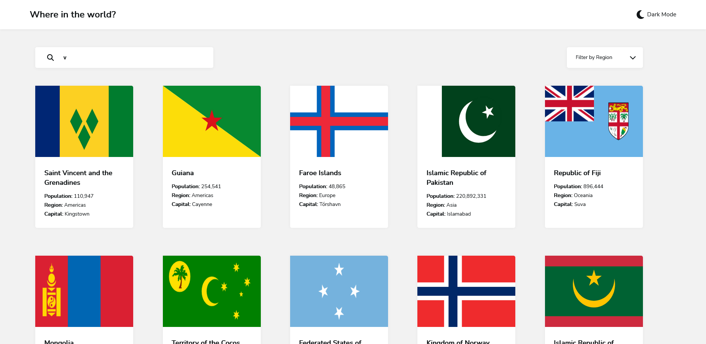
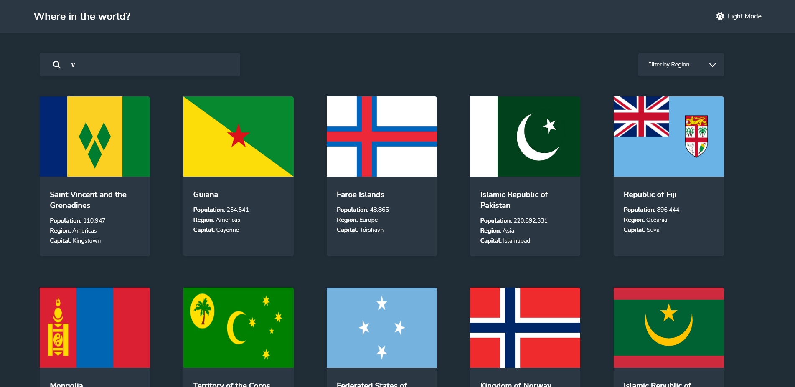

# Objective

Create a single-page application that will show the listing of all the countries in the world by using the [**REST Countries API**](https://restcountries.com/).

Pull all the data and show individual country. Display that flags that correlate to the countries.

[**Live Link**](https://rest-countries-eta-opal.vercel.app/)

# Features

- Light/Dark Mode
- Countries display affected by filter
  - Searchbar change countries on input
  - Region change when selected

# Packages

- Next.js
- TypeScript
- FontAwesome

# Screenshots

# Credit

Provided by [**Frontend Mentor**](https://www.frontendmentor.io/challenges/rest-countries-api-with-color-theme-switcher-5cacc469fec04111f7b848ca)
